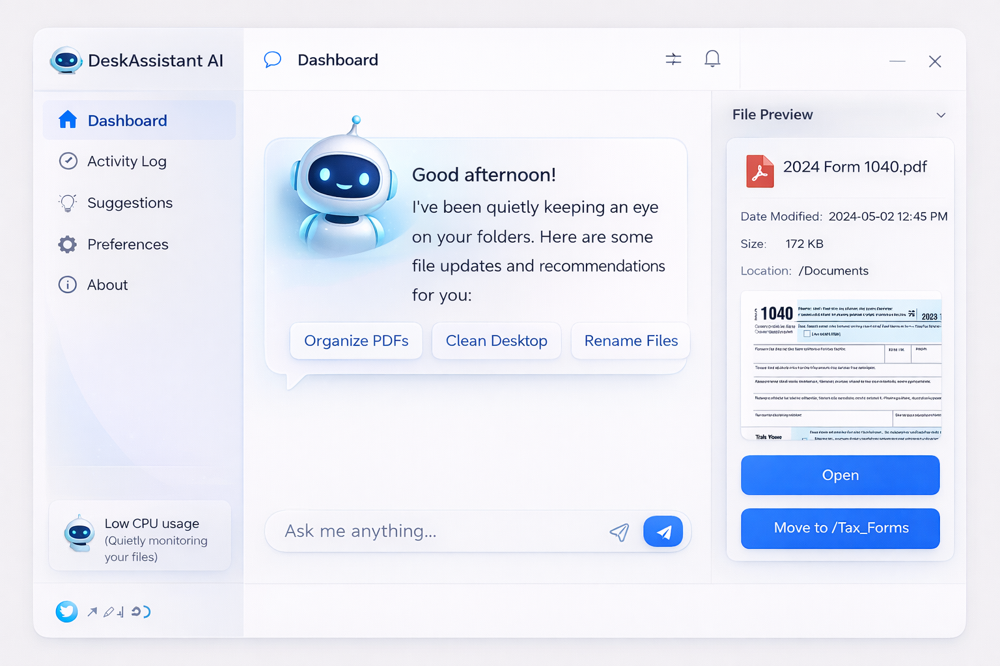

# Desk Assistant AI 🧠

Desk Assistant AI is a smart desktop assistant built using Electron that helps users manage tasks, search quickly, and interact with AI directly from their desktop.

## 🚀 Features

* AI powered assistant
* Desktop integration
* Fast search
* Simple user interface

## 📥 Download

Download the latest version from the website:
https://deskassistantai.vercel.app

## ⚙️ Installation

Clone the repository

git clone https://github.com/shreyasvengurlekar/desk-assistant-ai-application.git

Install dependencies

npm install

Run the application

npm start

## 🛠 Tech Stack

* Electron
* Node.js
* JavaScript

## 👨‍💻 Author

Shreyas Swapnil Vengurlekar
